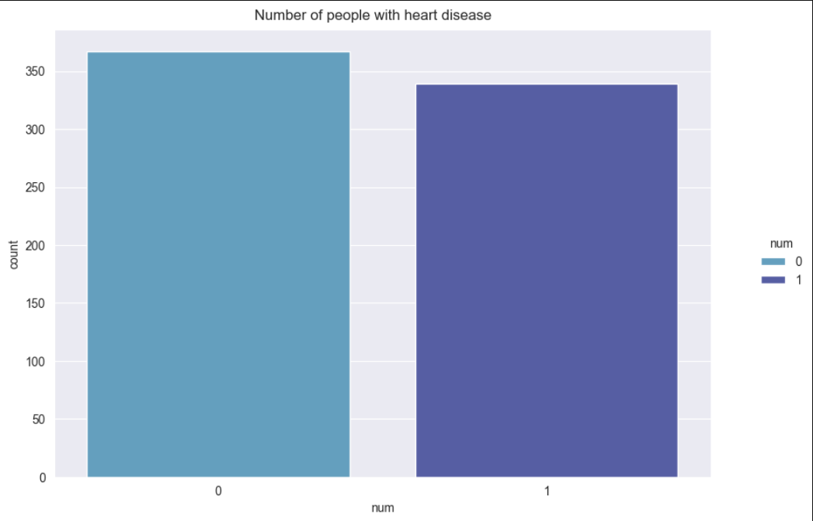
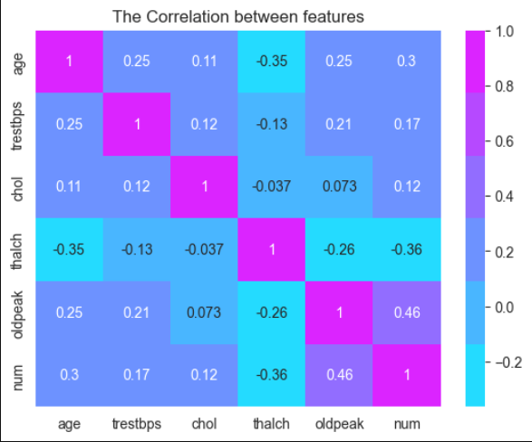
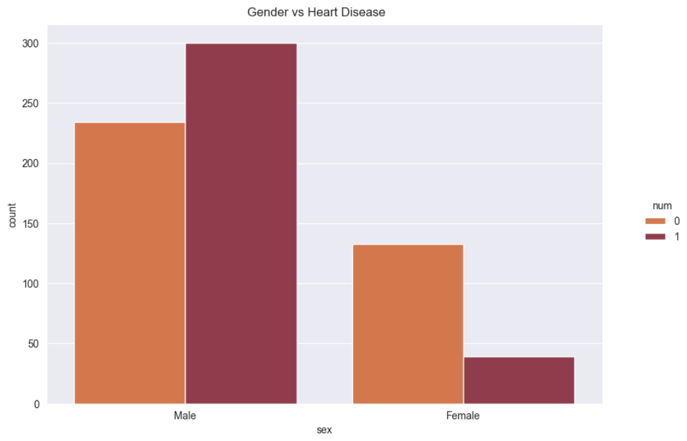
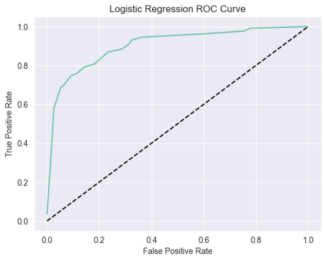
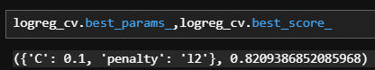

# UCI Heart Disease Analysis

## Project Overview
This project focuses on analyzing the UCI Heart Disease dataset by performing data preprocessing, feature engineering, and applying machine learning techniques to predict heart disease.

## Steps Followed
1. **Data Cleaning**
- Dropped columns with 5% or less missing values.
- Imputed missing categorical features with mode and numerical features with median using `SimpleImputer` while avoiding data leakage.

2. **Handling Outliers**
- Used the Interquartile Range (IQR) method to handle outliers in the `chol` column.

3. **Data Analysis & Visualization**
- Performed exploratory data analysis (EDA) to understand feature distributions and relationships Like:

**Heart Disease Count**
- The Data is almost balance between who have heart disease and who havn`t.

**Correlation between features**
- There is no strong Correlation between any two features.

**Gender Having Heart Disease**
- Male have highr Heart Disease rate than female.

4. **Feature Engineering**
- Applied Label Encoding and One-Hot Encoding for categorical features.

5. **Normalization**
- Used `RobustScaler` to normalize the dataset.

6. **Machine Learning Model**
- Trained a Logistic Regression model achieving:
  - Accuracy: **81.7%**
  - F1 Score: **82%**

7. **Model Evaluation**
- Plotted ROC Curve and computed ROC AUC Score: **90%**

8. **Hyperparameter Tuning**
- Used Grid Search to optimize `C` and `penalty` hyperparameters.

9. **Advanced Optimization**
- Implemented Logistic Regression with `Newton's Method` for optimization.

## Conclusion
This project successfully demonstrates data preprocessing, feature engineering, and machine learning techniques for heart disease prediction. The model performed well with an AUC score of 90% and an F1-score of 82%.